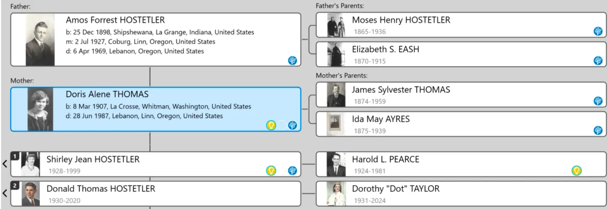
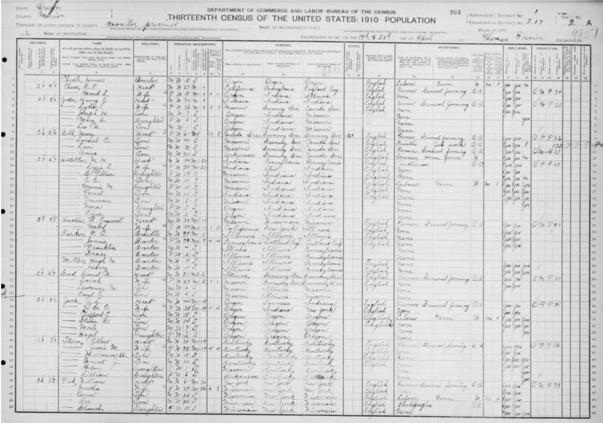

## Family Tree

## Life before marrage
### Amos Forrest Hostetler
Birth: 25 Dec 1899 Shipshewana, LaGrange County, Indiana, USA
#### 1900s
1900: Forrest lived with his parents and 3 siblings (Barbara Ellen, Christian Edward and Nannie M.) in Locke Township Nappanee town (part), Elkhart, Indiana, United States

1901: birth of brother, Truman Hobart Hostetler, in Missouri, United States

1905: birth of Sister, Nora Elizabeth Hostetler, in Oregon, United States.

1907: birth of brother, Pius Henry Hostetler in Marion Co., Oregon, United States
#### 1910s
1910 Census

Forest was 11 years old.

Living with parents and 7 siblings in Monitor, Marion Co, Oregon, United States

It looks like they moved from Indiana to Oregon around 1904 His Father, Moses Henry Hostetler, was an auctioneer.

1910: birth of brother, Daniel Harold Hostetler in Hubbard, Oregon, United States

1915: Forest’s Mother, Elizabeth S. Eash dies on 23 August 1915 in Hubbard, Oregon, United States

1916: Forest’s Father marries Mellie Kathryn Kauffman on 19 February 1916.

1917: High School Graduation Picture

